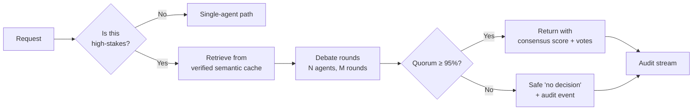

<!--
Copyright (c) 2026 Ramin Allazov (JavaAZE). All Rights Reserved.
-->

# Concept — Consensus

> For high-stakes outputs, Dirijor does not trust a single agent.
> Instead, multiple agents **debate** the answer and only proceed when
> **≥95% agree** — backed by a **verified semantic cache** that grounds
> claims in indexed, provenance-tagged facts.

This is the mechanism behind the PRD success criterion:

> *"Zero hallucination on high-stakes outputs via consensus + cache."*
> — [DIRIJOR-PRD.md](../../DIRIJOR-PRD.md)

## Why this exists

A single LLM is a probability distribution over plausible answers. Most
of the time, the most-likely answer is right. Sometimes — unpredictably —
it's confidently wrong. You can't fix this by making the model bigger;
you can only fix it by giving *something else* the ability to disagree.

Two "something elses" are practical today:

1. **Other agents** with different prompts, providers, or tools — who
   will disagree in the places the first agent was going to hallucinate.
2. **A verified semantic cache** — a retrieval layer of facts that have
   already been audited and tagged with provenance. If the debate agrees
   on a claim the cache contradicts, the debate is wrong.

Dirijor operationalizes both.

## The ≥95% threshold

The 95% quorum is intentional and comes straight from the PRD
non-negotiables:

> *"LangGraph-based Dirijor Core supervisor with multi-agent consensus
> (≥95% agreement) + Verified Semantic Cache."*

The threshold has three properties worth calling out:

- **High enough** that routine disagreements (different phrasing, minor
  factual deltas) fail the quorum — which is the whole point.
- **Sub-100%** because unanimity is a brittle signal. One stuck agent
  shouldn't wedge the whole realm.
- **Configurable per action class** — destructive actions can require
  higher thresholds; low-stakes reads can run at the default or skip
  consensus entirely.

See [ADR-0002 — Consensus threshold ≥95%](../../architecture/adr/0002-consensus-threshold-95.md)
for the full rationale and alternatives considered.

## The consensus flow (in plain English)

Key properties of this flow, in priority order:

1. **Below threshold → no decision.** Dirijor returns a structured
   "no decision" outcome — not a silent pass-through of the majority
   opinion. This is critical: a hallucination-proof system must be
   willing to *not answer*.
2. **Every outcome is audit-streamed.** Votes, per-agent opinions,
   cache hits, and the termination reason are recorded so compliance
   exports reconstruct the decision.
3. **The verified semantic cache is consulted first**, not last. Cache
   hits attach provenance IDs that agents can cite inside the debate.

## What "high-stakes" means

Not every agent call needs consensus. The supervisor classifies an
action as high-stakes when *any* of the following are true:

- It executes a tool with side effects (shell, email, payments, writes).
- It crosses a realm's egress boundary.
- A policy object flags the action class as requiring consensus.
- A human-in-the-loop gate is configured for this action class.

Read actions against the local realm, inspector queries, and canvas UI
fetches are **not** high-stakes by default. The point is to save the
debate for when disagreement buys you safety, not to tax every call.

## Why pair consensus with a verified semantic cache

Consensus alone has a failure mode: **agents can agree on a
hallucination.** Two instances of the same model, with the same training,
will correlate their mistakes. The semantic cache breaks that
correlation by grounding claims in an external, provenance-tagged
source of truth.

Story 4.1 ships the Qdrant-backed ingest/query surfaces and optional
consensus augmentation. When `QDRANT_URL` is unset, [`/health`](../../reference/supervisor-api.md)
reports `semantic_cache` as `required: false` with
`detail: "not configured"` — consensus still runs; `verified_facts` stay
empty until the cache is wired up.

## Current implementation status (v0.1)

- The LangGraph supervisor **graph** is in place (`backend/dirijor-core/supervisor.py`) with a **real debate loop** (Story 3.2): configurable `max_rounds` / `threshold`, per-round votes, `termination_reason`, and a safe no-decision path when quorum is not met.
- **Verified semantic cache** (Story 4.1) augments `POST /consensus` when `query_vector` + scope are supplied and Qdrant is configured; when the cache is off or misses, `verified_facts` stays empty and misses are logged — see the [supervisor API reference](../../reference/supervisor-api.md).

Claims that Dirijor delivers **"zero hallucination on high-stakes outputs"**
remain **aspirational** until Safety Fortress closes the remaining loop beyond
consensus + cache: **immutable audit export** (Story 4.3), broader
production-grade policy, and runtime hardening. **Anomaly auto-quarantine**
(JSON policy + supervisor hooks — Story 4.2) is shipped; it does not by itself
prove the full PRD safety bar. The PRD and `/health` contract stay explicit
about what is shipped vs planned — that honesty is the point of the API reference.

## Related reading

- [**Zero-trust by default**](zero-trust.md) — the other half of the safety story: network posture.
- [**ADR-0001 — LangGraph supervisor**](../../architecture/adr/0001-langgraph-supervisor.md) — why LangGraph is the orchestration substrate.
- [**ADR-0002 — Consensus threshold ≥95%**](../../architecture/adr/0002-consensus-threshold-95.md) — why 95% and not 100% / not majority.
- [**Supervisor API reference**](../../reference/supervisor-api.md) — the contract the canvas and your tooling bind to.
