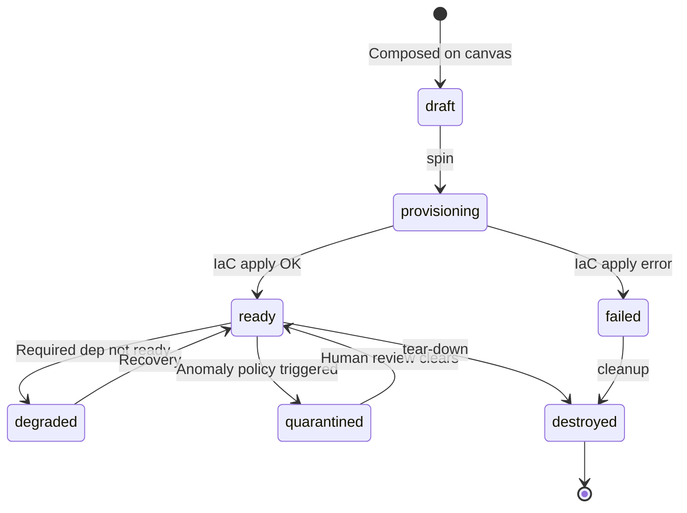

<!--
Copyright (c) 2026 Ramin Allazov (JavaAZE). All Rights Reserved.
-->

# Concept — Realms

> A **realm** is an isolated, zero-trust private network for a group of
> agents. It's the atomic unit of Dirijor: the thing you spin up, share,
> audit, and tear down.

## Why the concept exists

Most agent platforms treat "an agent" as the atomic unit. That's fine
until you have five agents and they all need to talk to each other,
share tools, and *not* leak into adjacent workloads. At that point you
either invent a network boundary or you ship a security incident.

Dirijor picks the boundary: **the realm**. Every agent lives inside
exactly one realm. Every piece of infrastructure (VMs, mesh nodes,
sandboxes, policy objects, audit streams) is scoped to a realm. A realm
is **private by default** — no public egress unless you explicitly add
a policy object that grants it.

This maps directly to the PRD non-negotiable:

> *"One-click Private Realm provisioning with Headscale/Tailscale mesh +
> mTLS + Firecracker sandboxing."*
> — [DIRIJOR-PRD.md](../../DIRIJOR-PRD.md)

## What a realm contains

Conceptually, a realm bundles five things:

1. **A topology** — the nodes and edges you composed on the canvas.
2. **A mesh identity** — a Headscale/Tailscale-class tailnet with mTLS.
   See [Zero-trust by default](zero-trust.md).
3. **A runtime plane** — Firecracker microVMs (where supported) running
   the OpenClaw wrapper, one sandbox per agent.
4. **A supervisor session** — a Dirijor Core process coordinating
   agent-to-agent traffic and consensus for this realm. See the
   [API reference](../../reference/supervisor-api.md).
5. **An audit stream** — an immutable event log scoped to this realm,
   exportable as a compliance package (PRD success criterion).

You never assemble those five pieces by hand. You compose them on the
canvas and spin them.

## The realm lifecycle

Two things about this lifecycle are non-negotiable:

- **`degraded` and `quarantined` are first-class states**, not error
  fallbacks. The supervisor's [`/health`](../../reference/supervisor-api.md)
  endpoint returns HTTP 503 with the same body shape as 200, so every
  caller (canvas, K8s, Docker Compose) observes degraded realms without
  screen-scraping.
- **A realm is never "half-deleted."** The audit stream is retained
  through `destroyed` so compliance exports remain valid after the
  infrastructure is gone.

## Why realms are isolated even from each other

The common question: *"Why not one big tailnet with namespaces?"*

Because **blast radius**. Realms are the unit of containment. If one
realm's agents are compromised — they invoke a malicious tool, leak a
key, hallucinate a destructive shell command — the damage stops at the
realm boundary. Other realms on the same host, the same cloud, even the
same mesh server, are unaffected.

This is what PRD non-negotiable #6 means in practice:

> *"100% private — zero public internet exposure by default."*

The "100%" is per-realm. It composes.

## What a user does with a realm

From the operator's perspective, the lifecycle is:

1. **Compose.** Drag agents onto the canvas, wire edges, pick a cloud adapter.
2. **Spin.** One click → a job id → phase transitions
   (`validating → provisioning → ready`).
3. **Operate.** Approve human-in-the-loop gates, watch safety metrics,
   inspect audit snippets — all inside the canvas.
4. **Export.** Ask for a compliance package at any time; get a signed
   archive scoped to this realm.
5. **Tear down.** One click → infrastructure destroyed, audit stream preserved.

The [first-realm tutorial](../../guides/tutorials/01-first-realm.md) walks
exactly this path end to end.

## Mental model for contributors

Internally, a realm is the **join key** across every subsystem:

| Subsystem | Realm shows up as |
|---|---|
| Canvas | The open topology tab |
| Dirijor Core | A `realm_id` on every consensus request |
| Safety Fortress | Policy scope + quarantine target |
| Realm Manager | A Terraform state root |
| Mesh | A tag/tailnet identifier |
| Runtime | A Firecracker microVM group |
| Observability | A trace resource attribute |
| Audit export | The archive scope |

If a piece of code needs to know "is this thing allowed?" the first
question it must answer is *which realm are we in?* No realm → no work.

## Related reading

- [Consensus](consensus.md) — what runs *inside* a realm when agents need to agree.
- [Zero-trust by default](zero-trust.md) — why the realm's network is locked down out of the box.
- [Architecture overview](../../architecture/overview.md) — how realms compose across the full system diagram.
